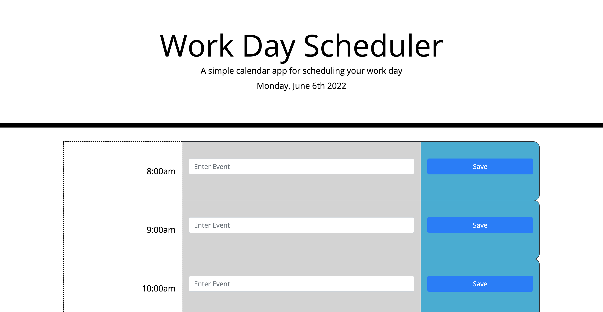
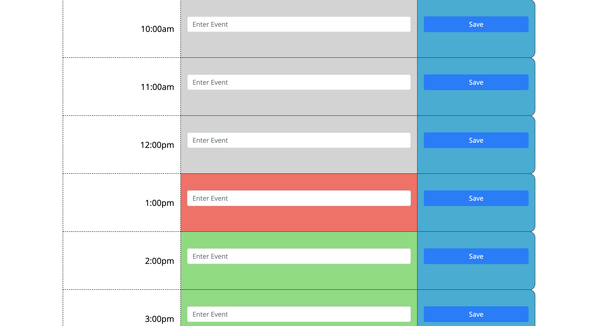
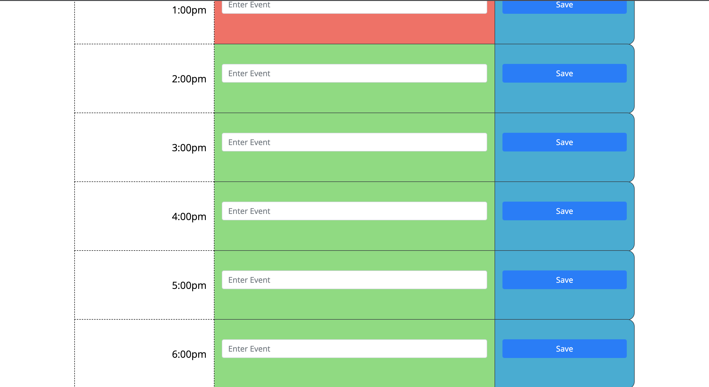

 # Work-Day-Scheduler 

## 📝 Table of Contents
* [License Utilized](#license-utilized)
* [Project Details](#project-details)
* [Usage Information](#usage-information)
* [Installation Instructions](#installation-instructions)
* [Contribution Guidelines](#contribution-guidelines)
* [Testing Guidelines](#testing-guidelines)
* [Any Questions ?](#any-questions)

## 🔑 License Utilized
N/A

## 🚀 Project Details
I created a work day scheduler using Bootstrap and JQuery. Based on the time of the day the time-blocks change color indicating whether they are in the past, present, or future. The user is able to enter the events they plan to do and when clicking the save button the input remains there after refreshing the page and is saved to local storage. [Deployed Application](https://jeanette-ralph.github.io/Work-Day-Scheduler/). 
 

## 👩‍💻 Usage Information
To help people organize what they will do for the day.

## 💻 Installation Instructions
N/A

## 🤝 Contribution Guidelines
N/A

## 💡 Testing Guidelines
N/A

## 🙋‍♀️ Any Questions?

If you have any further questions please reach out.

Email: jenette.k.ralph@gmail.com

GitHub link: [Jeanette-Ralph](https://github.com/Jeaanette-Ralph)

GitHub username: /Jeanette-Ralph

